# 01 — Entity Relationship Explanations

This document explains the key entities and how they relate, grouped by bounded context. Diagrams are simplified (key columns / FKs only). Every tenant-scoped table additionally carries `corporation_id` and the standard audit columns (`created_at/by`, `updated_at/by`, `deleted_at`, `row_version`).

> Legend: `1—∞` one-to-many · `∞—∞` many-to-many (via junction) · dashed = soft (no DB-level FK, intentional to avoid cycles).

---

## 1. Tenancy & Identity (Layer 1)

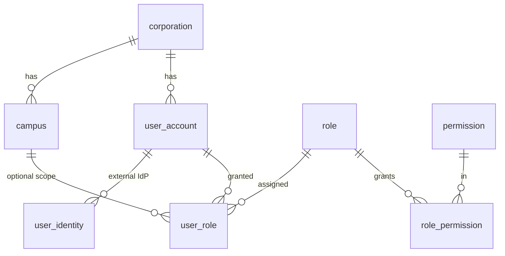

- **corporation** is the tenant root. **campus** is a branch within a corporation. Users belong to a corporation and optionally have a primary campus.
- **user_role** is the RBAC grant. Its optional `campus_id` makes a grant *campus-scoped*: the same user can be an Administrator at one campus and a read-only user elsewhere.
- **permission** is a global `resource:action` catalog; **role_permission** maps permissions to roles. Authorization = union of permissions across a user's active `user_role` grants, filtered by campus scope.
- **menu_item** is a self-referential tree; visibility is driven by `required_permission_id`, so menus are *dynamic* per user.

---

## 2. Configurable Reference Data (Layer 1)

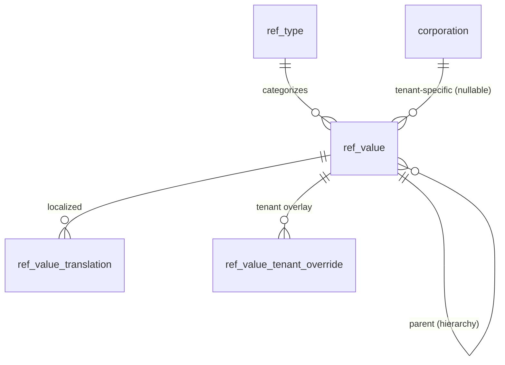

- **ref_type** is the *catalog of lists* (`session_type`, `therapy_type`, …). **ref_value** holds the entries. `corporation_id IS NULL` ⇒ system/global; set ⇒ tenant-specific.
- Business tables reference **ref_value(id)** (e.g. `session.session_type_id`). `scheduling.session` additionally pins the category via a **composite FK** `(session_type_ref_type, session_type_id) → ref_value(ref_type_id, id)`, so a value of the wrong category is rejected by the database.
- **ref_value_tenant_override** lets a tenant deactivate / reorder / re-default a shared value without mutating it. The view `ref.v_effective_ref_value` resolves the tenant-effective list.

---

## 3. CRM → Admissions → Student (lifecycle spine)

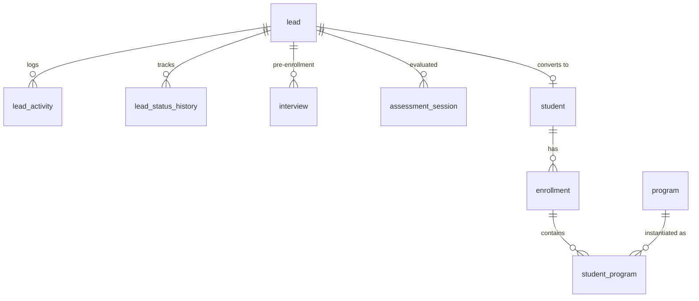

- A **lead** moves through `lead_status` / `pipeline_stage` (both reference data). Communication is captured in **lead_activity**; pre-enrollment **interview** records outcomes.
- On conversion, `lead.converted_student_id` links to **student** (and `student.lead_id` keeps the back-reference as a soft link). Assessment history attached to the lead remains valid because **assessment_session** can reference *either* a `lead_id` or a `student_id`.
- **enrollment** is the overall lifecycle record (status from `enrollment_status`); **student_program** binds a student to one or more **programs** (a student may have many concurrent programs).

---

## 4. Assessment & Evaluation

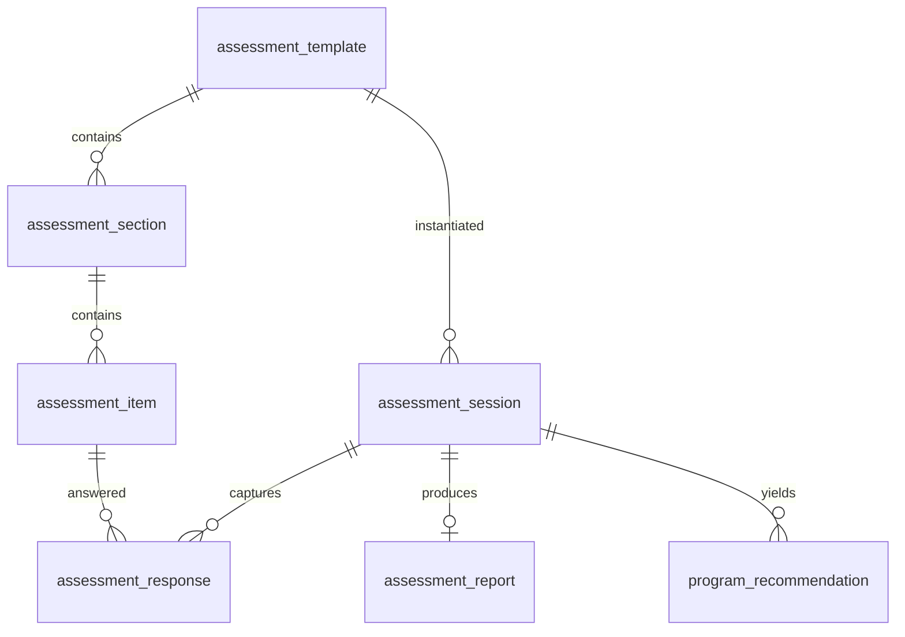

- **assessment_template** (versioned, translatable) defines sections and items. An **assessment_session** is one administration of a template to a lead/student by an assessor (educator), capturing **assessment_response** rows and an **assessment_report**.
- **program_recommendation** is the bridge to enrollment; `recommended_program_id` is a soft reference to `education.program` (avoids a cross-domain cycle).

---

## 5. Students, Guardians & Clinical/Case Management

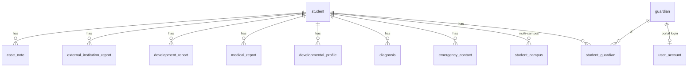

- **student_campus** models multi-campus service delivery (a student may attend several campuses, one flagged primary).
- **student_guardian** is the M:N with `relationship_id`, custody, portal, and financial-responsibility flags. A **guardian** gains portal access by linking to a **user_account**.
- Clinical records (**diagnosis**, **medical_report**, etc.) are KVKK special-category data: soft-deleted, audited (DB trigger), and their files flagged `is_sensitive`.

---

## 6. Educators & Hierarchy

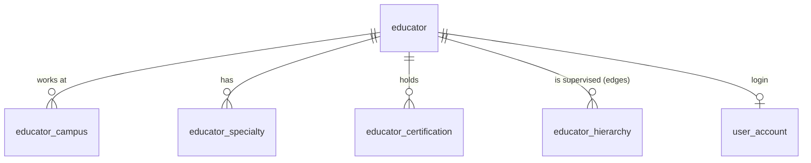

- **educator.title_id** is configurable reference data (Therapist/Psychologist/Consultant/… and any tenant addition).
- **educator_hierarchy** is an *edge list* (`educator_id`, `supervisor_id`, `relationship_id`, optional `campus_id`) — a flexible graph supporting Educator → Consultant → Coordinator and any depth, optionally per campus.

---

## 7. Goals & Education Plan (BEP/IEP)

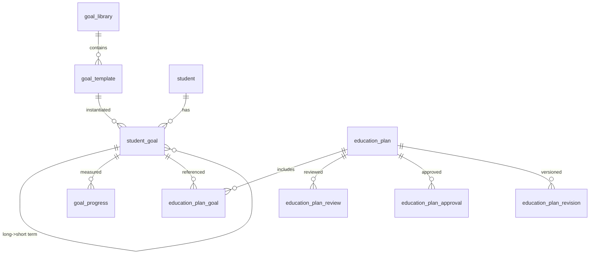

- Reusable **goal_template** (translatable; categorized by `goal_category` / `development_area`) instantiate into **student_goal** (which can nest long-term → short-term via `parent_goal_id`).
- **goal_progress** is the time series for trend analysis. **education_plan** (BEP) bundles goals, carries `status` (draft→approved→active), is approved by a coordinator (**education_plan_approval**), and is visible to guardians only when `status='approved'` AND `guardian_visible=true`. **education_plan_revision** snapshots versions.

---

## 8. Scheduling (Sessions, Rooms, Recurrence, Attendance, Make-up)

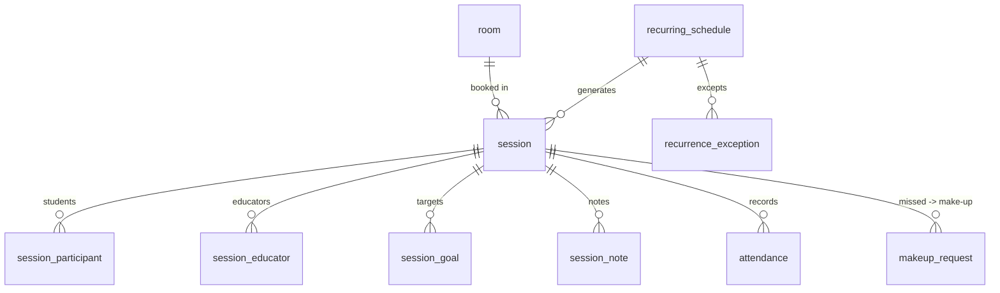

- **session** is the single schedulable unit; `session_type_id` is configurable (composite-FK pinned). `time_range` is a generated `tstzrange` used for conflict checks.
- **Conflict prevention:** an `EXCLUDE USING gist` constraint blocks overlapping non-cancelled sessions in the same **room**; a trigger blocks an **educator** being double-booked across sessions.
- **session_participant** (M:N students) supports group/intensive/camp sessions; **session_educator** (M:N) supports co-treatment. **session_note.parent_visible** governs portal exposure.
- **attendance** (reason = reference data) feeds statistics; **makeup_request** tracks a missed session through scheduling and completion.

---

## 9. Finance

```mermaid
erDiagram
  package_definition ||--o{ student_package : purchased
  student_package ||--o{ credit_ledger : "balance (append-only)"
  student_package ||--o{ invoice_line : billed
  invoice ||--o{ invoice_line : contains
  invoice ||--o{ payment : "paid by"
  payment ||--o{ refund : refunded
  invoice ||--o{ discount : applies
  student ||--o{ scholarship : awarded
  session ||--o{ credit_ledger : consumes
```

- **student_package** holds purchased credits; the *authoritative balance is the SUM of* **credit_ledger** *deltas* (grant/consume/refund/expire) — never a mutable column. A consumed session writes a `consume` ledger row.
- **invoice/invoice_line/payment/refund** model billing; **payment.idempotency_key** dedupes gateway callbacks. **discount/scholarship/promotion** types are all reference data.

---

## 10. Contracts & Consent (KVKK)

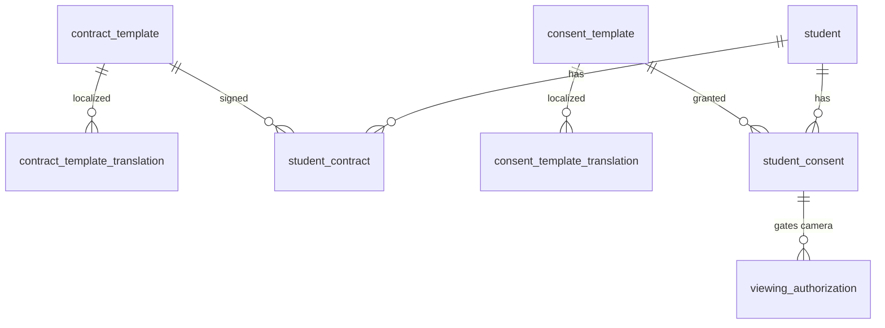

- Templates are versioned and translatable; signed instances (**student_contract**) store the immutable signed file and e-signature reference.
- **student_consent** is the KVKK consent ledger (granted/withdrawn). A `camera_viewing` consent is what authorizes **media.viewing_authorization**.

---

## 11. Camera & Live Viewing

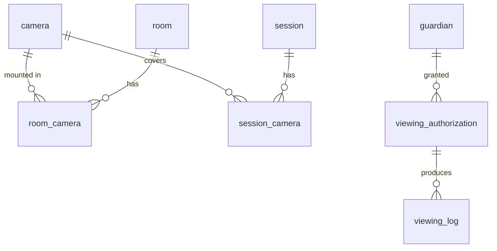

- **viewing_authorization** is time-boxed, tied to a backing `camera_viewing` consent, and produces an immutable **viewing_log** (who watched what, when) for privacy auditing.

---

## 12. Meetings, Leave, Performance · Camps · Consultancy

- **ops.meeting** (type = reference data) with **meeting_participant** (users/guardians/leads/external), **meeting_outcome**, **meeting_follow_up** (action items).
- **ops.leave_request** (type = reference data) with an `EXCLUDE` constraint preventing overlapping leave, an approval chain (**leave_approval**), and **leave_balance** accruals.
- **ops.educator_performance_snapshot** rolls up session volume, attendance, goal-achievement, parent feedback, utilization — also expressible generically via `core.kpi_value`.
- **camps.camp → camp_period → camp_enrollment → camp_attendance/camp_report**; reuses reference data (`camp_type`, `attendance_reason`).
- **consultancy.institution → consultancy_plan → school_visit → observation_record → consultancy_report** (`institution_type` = reference data).

---

## 13. Parent Portal (projection layer)

The portal is mostly authorization over existing domains. **students.guardian_portal_access** holds per-(guardian, student) visibility switches. Read views (`v_portal_my_students`, `scheduling.v_portal_sessions`, `finance.v_portal_package_balance`, `education.v_portal_education_plan`) resolve the current portal user via `core.current_user_id()` and respect `parent_visible` / approved-status gates. RLS on base tables still applies.
