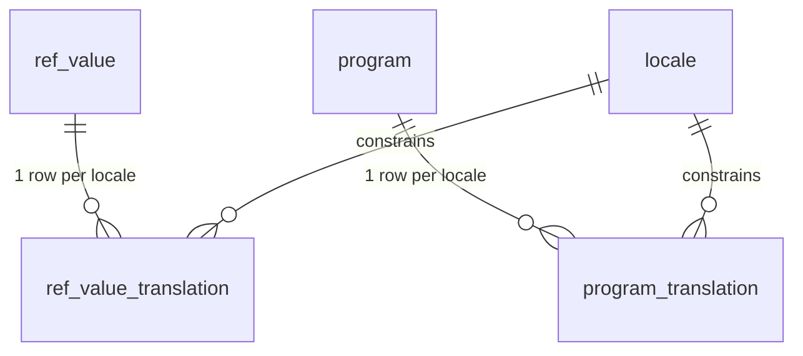

# 05 — Translation Entity Design

This document specifies the **translation table pattern** used platform-wide and why it was chosen over the alternatives.

## The chosen pattern: per-entity sidecar translation tables

For every translatable entity `X`, a companion table `X_translation`:

```
X_translation (
  X_id     <fk to X, on delete cascade>,
  locale   text references ref.locale(code),
  <translated columns...>,   -- e.g. label, name, description, body
  primary key (X_id, locale)
)
```

Applied to: `ref_value_translation`, `program_translation`, `goal_template_translation`,
`assessment_template_translation`, `contract_template_translation`,
`consent_template_translation`, `notification_template_translation`, `menu_item_translation`.

The base row keeps the **source/canonical** values (`code`, source `name`) and any non-translatable attributes; the sidecar holds locale-specific text.



## Why this over the alternatives

| Approach | Verdict | Reason |
|---|---|---|
| **Columns per language** (`name_tr`, `name_en`) | ✗ Rejected | Schema change to add a language; sparse; unindexable per-locale; explodes with many fields. |
| **One generic EAV translation table** (`entity_type, entity_id, column, locale, value`) | ✗ Rejected as primary | No referential integrity (dangling `entity_id`), no type safety, awkward multi-column rows, poor query plans. |
| **Per-entity sidecar tables** (chosen) | ✓ | Real FKs + `ON DELETE CASCADE`, `(entity_id, locale)` PK, naturally indexed, type-safe, easy joins, easy "missing translation" reports. |
| **Key/value `i18n_message`** | ✓ (for UI strings only) | Perfect for volatile static copy that isn't tied to a row; not used for entity content. |

We deliberately accept "more tables" in exchange for **referential integrity and query performance**, which matter most for the catalogs and templates that are read constantly.

## Read path

- Convenience resolver functions/views return the best label for the current locale with fallback (see `ref.value_label` and `ref.v_effective_ref_value`).
- A typical localized read is a `LEFT JOIN X_translation t ON t.X_id = X.id AND t.locale = :loc`, with a `COALESCE` fallback to the source column. This keeps the hot path a single indexed join.

## Write path & integrity rules

- Creating/updating an entity in the UI writes the base row + one `*_translation` row per provided locale (upsert on `(X_id, locale)`).
- `locale` is FK-checked against `ref.locale`, so only supported languages can be stored.
- Deleting an entity cascades its translations.
- Translations are **not** versioned by default; template entities (contracts/consents/assessments) carry their own `version` on the base row, and translations belong to that version.

## Adding a new translatable entity (checklist)

1. Add the base table with source columns + `code`.
2. Add `X_translation (X_id, locale, <text cols>, pk(X_id, locale))`.
3. (Optional) add a localized view or extend the resolver for fallback.
4. No change to the localization engine, the `locale` table, or other modules.

## Adding a new language (checklist)

1. `INSERT INTO ref.locale (...)`.
2. Backfill translations (admin UI or import); run the untranslated-values report.
3. Done — no DDL anywhere else.
